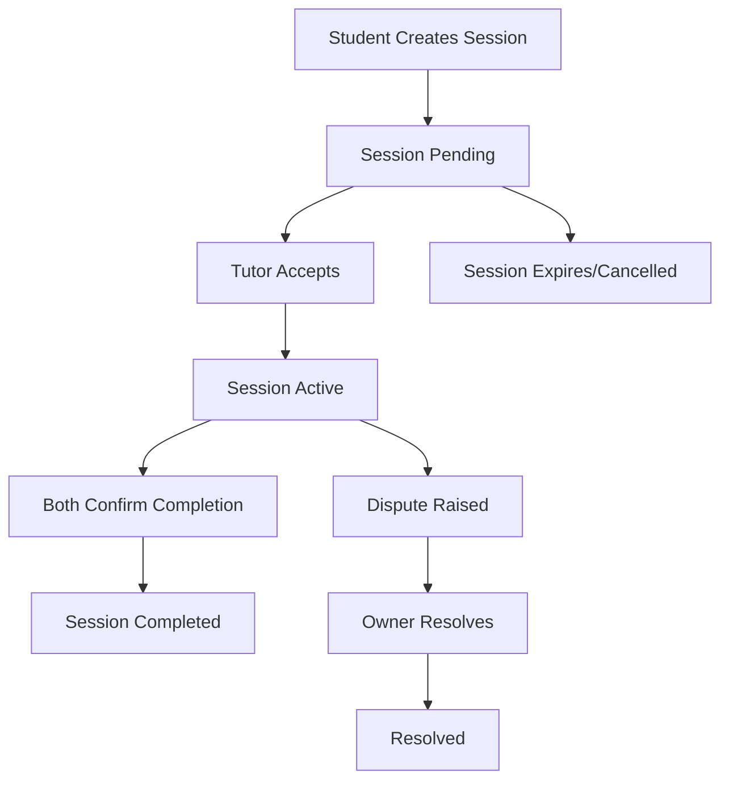

# 🎓 Peer-to-Peer Tutoring Escrow

A smart contract built on Stacks blockchain that enables secure peer-to-peer tutoring sessions with escrow functionality. Students pay for tutoring sessions in STX, and funds are held in escrow until both parties confirm lesson completion.

## ✨ Features

- 📝 **Tutor Profiles**: Tutors can create profiles with hourly rates, subjects, and ratings
- 💰 **Secure Escrow**: Student payments are held securely until lesson completion
- ✅ **Dual Confirmation**: Both student and tutor must confirm session completion
- ⭐ **Rating System**: Rate and review completed sessions
- 🚨 **Dispute Resolution**: Built-in dispute mechanism with owner arbitration
- 📊 **Session Tracking**: Complete session lifecycle management

## 🚀 Quick Start

### For Tutors

1. **Create Profile**
   ```clarity
   (contract-call? .p2p-tutoring create-tutor-profile u50 (list "Math" "Physics"))
   ```

2. **Accept Session**
   ```clarity
   (contract-call? .p2p-tutoring accept-session u1)
   ```

3. **Confirm Completion**
   ```clarity
   (contract-call? .p2p-tutoring tutor-confirm-completion u1)
   ```

### For Students

1. **Create Session**
   ```clarity
   (contract-call? .p2p-tutoring create-session 'SP123... "Calculus Help" u60 u1000000)
   ```

2. **Confirm Completion**
   ```clarity
   (contract-call? .p2p-tutoring student-confirm-completion u1)
   ```

3. **Rate Session**
   ```clarity
   (contract-call? .p2p-tutoring rate-session u1 u9 "Great tutor!")
   ```

## 📋 Contract Functions

### Public Functions

| Function | Description |
|----------|-------------|
| `create-tutor-profile` | Create a tutor profile with hourly rate and subjects |
| `update-tutor-status` | Enable/disable tutor availability |
| `create-session` | Student creates a new tutoring session |
| `accept-session` | Tutor accepts a pending session |
| `student-confirm-completion` | Student confirms session completion |
| `tutor-confirm-completion` | Tutor confirms session completion |
| `cancel-session` | Cancel a session (refunds student) |
| `dispute-session` | Initiate dispute resolution |
| `rate-session` | Rate and review completed session |

### Read-Only Functions

| Function | Description |
|----------|-------------|
| `get-session` | Get session details by ID |
| `get-tutor-profile` | Get tutor profile information |
| `get-session-rating` | Get session ratings and feedback |
| `get-contract-balance` | Get contract's STX balance |

## 🔄 Session Lifecycle



## 💡 Usage Examples

### Complete Session Flow

```bash
# 1. Tutor creates profile
clarinet console
(contract-call? .p2p-tutoring create-tutor-profile u50 (list "Math" "Science"))

# 2. Student creates session (1 hour Math tutoring for 0.01 STX)
(contract-call? .p2p-tutoring create-session 'ST1TUTOR... "Algebra" u60 u1000000)

# 3. Tutor accepts session
(contract-call? .p2p-tutoring accept-session u1)

# 4. After lesson, both parties confirm
(contract-call? .p2p-tutoring student-confirm-completion u1)
(contract-call? .p2p-tutoring tutor-confirm-completion u1)

# 5. Student rates the session
(contract-call? .p2p-tutoring rate-session u1 u8 "Very helpful!")
```

## 🛠️ Development

### Prerequisites
- Clarinet CLI installed
- Stacks wallet for testing

### Testing
```bash
clarinet check
clarinet test
```

### Deployment
```bash
clarinet deploy --network testnet
```

## 📊 Fee Structure

- Contract fee: 2.5% (250 basis points)
- Fees are automatically deducted when sessions complete
- Remaining balance goes to tutor

## 🔒 Security Features

- ✅ Authorization checks for all actions
- ✅ Input validation and error handling
- ✅ Secure escrow with automatic release
- ✅ Owner-controlled dispute resolution
- ✅ Session expiration protection

## 📞 Support

For questions or issues, please create an issue in this repository.

---

Built with ❤️ on Stacks blockchain
